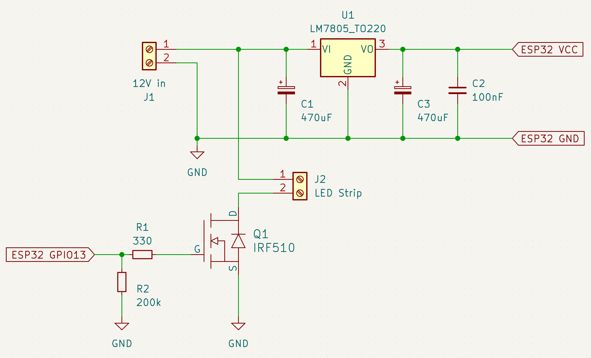

# UV Exposure Device

When planning my first attempt to etch my own circuit boards, I realized that I needed a solution for exposing the circuit boards to UV light. Of course, it was tempting for me to solve this task on a DIY basis as well. Many people on the net have built their own UB exposure devices based on old flatbed scanners. I liked that idea and so I built my own UV exposure device too:

## Architecture

I found an old defective flatbet scanner for my project. I barely managed to put the components inside the case but there was almost no space for a small display, a rotary encoder and such things. So I thought it would be nice to control the device from my smartphone via bluetooth. That would give me a lot of options like individual presets and a nice GUI. I never developed a native App for iOS before. I was always convinced that platform-independend web-apps would be the right way to go. So I (successfully!) wrote a small Javascript program which proofed that the UV device could be controlled from a website via bluetooth. But... iOS does not support webserial (the required functionality) yet. So, give up the plan or develop a native app for iOS? I tried the later. I turned out that it wasn't that hard to do it in Swift with XCode and everything worked out quite nicely.

### Schematic

The schematic is simple as can be. We have an LED strip with a 12V power supply. The ESP32 can be fed by this source too. We use a 7805 to turn the 12V into 5V and we use an IRF510 MOSFET (many other logic-level MOSFETs should work too) to switch the LED strip on and off. 

